# MamTo.pl

Platforma ogłoszeniowa typu marketplace — użytkownicy mogą bezpłatnie publikować aukcje i ogłoszenia,
przeglądać oferty według kategorii, kontaktować się ze sprzedawcami przez wbudowany czat oraz
zarządzać własnym kontem. Aplikacja posiada panel administratora oraz osobny interfejs RestApi.
## Autorzy

- [Mateusz Serafin](https://www.github.com/xserafineq)
- [Przemysław Sulowski](https://www.github.com/sulmorski)


## Podział zadań

| Autor | Zadanie |
|---------|-------------|
| **Mateusz Serafin** | Zaprojektowanie interfejsu w Figma |
| **Mateusz Serafin** | Implementacja podstawowego layoutu |
| **Mateusz Serafin** | Rejestracja / Logowanie |
| **Mateusz Serafin** | Aukcje (tworzenie, edycja) |
| **Mateusz Serafin** | Aukcje (tworzenie, edycja) |
| **Mateusz Serafin** | Profil użytkownika / Ustawienia profilu |
| **Mateusz Serafin** | Panel Administratora (zarządzanie aukcjami, administratorami, użytkownikami, akceptacji aukcji) |
| **Mateusz Serafin** | RestApi |
| **Przemysław Sulowski** | Prywatny chat (zainteresowany kupnem -> sprzedający) |
| **Przemysław Sulowski** | Wyszukiwanie aukcji z zaawansowanym filtrowaniem |
| **Przemysław Sulowski** | Implementacja kategorii drzewiastych |
| **Przemysław Sulowski** | Panel Administratora (zarządzanie kategoriami) |
| **Przemysław Sulowski** | Ocenianie użytkowników |
| **Przemysław Sulowski** | Przygotowanie seederów |


## Technologie

| Warstwa | Technologie |
|---------|-------------|
| **Backend** | PHP 8.3+, Laravel 13, Laravel Sanctum |
| **Baza danych** | PostgreSQL 16 |
| **Frontend** | Blade, Bootstrap 5, JavaScript (Vite), Tailwind CSS 4 |
| **Mapy / lokalizacja** | Leaflet, geokodowanie (Nominatim) |
| **Serwer WWW** | Apache (PHP 8.4) w kontenerze `app` |
| **Build assetów** | Vite 8, npm |
| **Konteneryzacja** | Docker, Docker Compose |
## Przeznaczenie Aplikacji

Głównym celem jest stworzenie miejsca w internecie, gdzie zwykli ludzie (albo małe firmy) mogą bez żadnych opłat wystawić na sprzedaż swoje stare meble, ubrania czy elektronikę, a inni mogą te rzeczy łatwo znaleźć i kupić.
## Opis funkcjonalności

### Strona główna

**Kategorie główne**  
Wyświetla kafelki głównych kategorii (Motoryzacja, Elektronika, Praca itd.) ze zdjęciami. Kliknięcie przenosi na listę ogłoszeń z filtrem wybranej kategorii.

**Najnowsze aukcje**  
Sekcja sześciu najnowszych ogłoszeń ładowana dynamicznie po wejściu na stronę — dane pobierane asynchronicznie i wyświetlane jako karty z tytułem, ceną i linkiem do szczegółów.

---

### Wyszukiwanie ogłoszeń
Po wpisaniu w wyszukiwarce znajdującej się w menu głównym nazwy aukcji, która może nas interesować przenosi nas do strony z wynikami wyszukiwań.

Dostępne filtry:
- **Kategoria** — drzewo kategorii z licznikami ogłoszeń
- **Fraza** — wyszukiwanie po tytule
- **Cena** — zakres min / max
- **Miasto i promień** — wyszukiwanie miejscowości z podpowiedziami oraz filtrowanie po odległości (km)
- **Sortowanie** — najnowsze / najstarsze

**Szczegóły ogłoszenia**  
Pełny widok oferty: karuzela zdjęć, cena lub wynagrodzenie, dane sprzedawcy, lokalizacja, data dodania, opis oraz inne ogłoszenia tego samego użytkownika. Ogłoszenia nieaktywne lub oczekujące na akceptację są widoczne tylko dla właściciela i administratora.

**Publiczny profil użytkownika**  
Dostępny po kliknięciu avatara lub imienia sprzedawcy na stronie ogłoszenia. Prezentuje nazwę użytkownika (imię i nazwisko), datę dołączenia do serwisu oraz listę publicznych ogłoszeń użytkownika. Nie wyświetla adresu e-mail ani numeru telefonu.


---

### Rejestracja i logowanie

**Rejestracja**  
Formularz z imieniem, nazwiskiem, e-mailem, numerem telefonu i hasłem. Po poprawnej rejestracji użytkownik jest automatycznie logowany i przekierowywany na stronę główną.

**Logowanie**  
Logowanie adresem e-mail i hasłem. Sesja utrzymywana przez mechanizm Laravel (cookie).

**Wylogowanie**  
Kończy sesję użytkownika i przekierowuje na stronę główną.

---

### Ogłoszenia — użytkownik zalogowany

**Tworzenie ogłoszenia**  
Formularz z tytułem, opisem, kategorią, ceną, lokalizacją (mapa z pinezką), miniaturą i do czterech dodatkowych zdjęć. Dla kategorii **Praca** dostępne są osobne pola wynagrodzenia (np. brutto/h, do uzgodnienia). Ogłoszenia z kategorii Praca trafiają do akceptacji administratora i nie są od razu publiczne.

**Moje ogłoszenia**  
Lista własnych ogłoszeń z podziałem na aktywne, zamknięte i oczekujące na akceptację (liczniki + statusy na kartach).

**Edycja ogłoszenia**  
Możliwa tylko dla własnych, aktywnych ogłoszeń. Zmiana kategorii na Praca wymaga ponownej akceptacji przez administratora.

**Zamykanie ogłoszenia**  
Ustawia status „zakończone”. Operacja nieodwracalna — zamkniętego ogłoszenia nie można edytować.

---

### Obserwowane ogłoszenia

**Dodawanie / usuwanie**  
Na stronie ogłoszenia zalogowany użytkownik może dodać ofertę do obserwowanych lub usunąć ją stamtąd (bez przeładowania strony). Nie działa na własnym ogłoszeniu.

**Lista obserwowanych**  
Paginowana lista aktywnych, zaakceptowanych ogłoszeń dodanych do obserwowanych.

---

### Czat / wiadomości

**Rozpoczęcie rozmowy**  
Przycisk „Napisz wiadomość” na stronie ogłoszenia tworzy czat między kupującym a sprzedawcą (lub otwiera istniejący). Właściciel ogłoszenia nie może napisać do siebie.

**Lista rozmów**  
Wszystkie czaty zalogowanego użytkownika, posortowane po ostatniej wiadomości.

**Widok czatu**  
Historia wiadomości w danej rozmowie oraz formularz wysyłki nowej wiadomości. Nowe wiadomości widać po odświeżeniu strony.

---

### Profil użytkownika

**Profil użytkownika (ustawienia)**  
Edycja imienia, nazwiska, adresu e-mail i numeru telefonu.

**Zmiana hasła**  
Wymaga podania obecnego hasła oraz nowego (z potwierdzeniem).

---

### Panel administratora

Dostępny dla użytkowników z uprawnieniami administratora. Wejście z menu konta.

**Aukcje**  
Przegląd wszystkich ogłoszeń w systemie (aktywne / zamknięte). Podgląd, edycja (w tym status), usuwanie. Paginacja z możliwością przewijania numerów stron.

**Do akceptacji**  
Lista ogłoszeń z kategorii **Praca** oczekujących na publikację. Administrator zatwierdza ogłoszenie — staje się ono widoczne publicznie.

**Użytkownicy**  
Lista wszystkich kont z wyszukiwaniem. Edycja danych użytkownika, usuwanie konta (wraz z powiązanymi danymi). Główny administrator może nadawać lub odbierać rolę administratora.

**Inni administratorzy**  
Lista administratorów systemu. Główny administrator zarządza ich uprawnieniami.

**Kategorie**  
Zarządzanie drzewem kategorii: dodawanie (nazwa, kategoria nadrzędna, opcjonalne zdjęcie), edycja, usuwanie (tylko gdy kategoria nie ma podkategorii ani przypisanych ogłoszeń).

---


## Diagram ERD

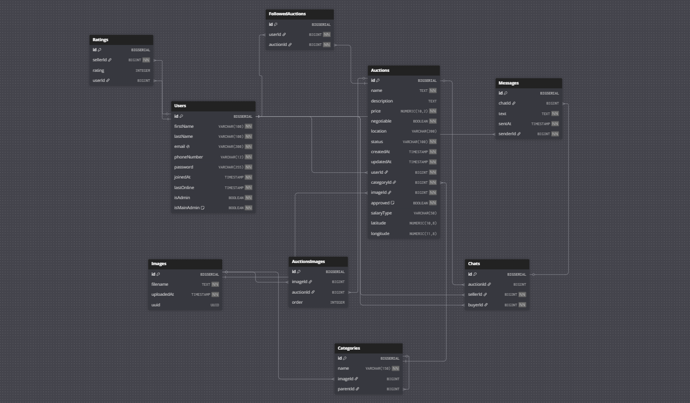

### Tabela `Users`

Konta użytkowników platformy (zwykli użytkownicy i administratorzy).

| Kolumna | Typ | Opis |
|---------|-----|------|
| `id` | BIGINT (PK) | Identyfikator użytkownika |
| `firstName` | VARCHAR(100) | Imię |
| `lastName` | VARCHAR(100) | Nazwisko |
| `email` | VARCHAR(200), UNIQUE | Adres e-mail (login) |
| `phoneNumber` | VARCHAR(12) | Numer telefonu |
| `password` | VARCHAR(255) | Hasło (hash bcrypt) |
| `joinedAt` | TIMESTAMP | Data rejestracji |
| `lastOnline` | TIMESTAMP | Ostatnia aktywność |
| `isAdmin` | BOOLEAN | Czy użytkownik ma dostęp do panelu administratora |
| `isMainAdmin` | BOOLEAN, default `false` | Czy to główny administrator (nieusuwalny) |

**Relacje:**
- 1 → N `Auctions` (właściciel ogłoszeń, kolumna `userId`)
- 1 → N `Chats` jako sprzedawca (`sellerId`) lub kupujący (`buyerId`)
- 1 → N `Messages` (nadawca, kolumna `senderId`)
- 1 → N `FollowedAuctions` (obserwowane ogłoszenia)
- 1 → N `Ratings` jako oceniany (`sellerId`) lub oceniający (`userId`)

---

### Tabela `Images`

Metadane przechowywanych plików graficznych (zdjęcia ogłoszeń i kategorii).

| Kolumna | Typ | Opis |
|---------|-----|------|
| `id` | BIGINT (PK) | Identyfikator obrazu |
| `filename` | TEXT | Nazwa / ścieżka pliku w storage |
| `uploadedAt` | TIMESTAMP | Data wgrania |
| `uuid` | UUID, nullable | Opcjonalny identyfikator pliku |

**Relacje:**
- 1 → N `Auctions` (miniatura ogłoszenia, kolumna `imageId`)
- 1 → N `AuctionsImages` (zdjęcia w galerii ogłoszenia)
- 1 → N `Categories` (ikona kategorii, kolumna `imageId`)

---

### Tabela `Categories`

Drzewo kategorii ogłoszeń (np. Motoryzacja → Samochody osobowe).

| Kolumna | Typ | Opis |
|---------|-----|------|
| `id` | BIGINT (PK) | Identyfikator kategorii |
| `name` | VARCHAR(150) | Nazwa kategorii |
| `imageId` | BIGINT (FK → `Images`), nullable | Zdjęcie kategorii; przy usunięciu obrazu → `NULL` |
| `parentId` | BIGINT (FK → `Categories`), nullable | Kategoria nadrzędna; `NULL` = kategoria główna |

**Relacje:**
- N → 1 `Categories` (self-reference przez `parentId` — struktura drzewiasta)
- N → 1 `Images` (ikona kategorii)
- 1 → N `Auctions` (ogłoszenia w danej kategorii)

**Uwaga biznesowa:** kategoria **Praca** i wszystkie jej podkategorie wymagają akceptacji administratora przed publikacją ogłoszenia (`approved = false`).

---

### Tabela `Auctions`

Główna encja systemu — ogłoszenia / aukcje.

| Kolumna | Typ | Opis |
|---------|-----|------|
| `id` | BIGINT (PK) | Identyfikator ogłoszenia |
| `name` | TEXT | Tytuł ogłoszenia |
| `description` | TEXT, nullable | Opis oferty |
| `price` | NUMERIC(10,2) | Cena lub wynagrodzenie |
| `negotiable` | BOOLEAN | Czy cena do negocjacji / „do uzgodnienia” |
| `location` | VARCHAR(200), nullable | Opis lokalizacji (miasto, adres tekstowy) |
| `latitude` | NUMERIC(10,8), nullable | Szerokość geograficzna (mapa) |
| `longitude` | NUMERIC(11,8), nullable | Długość geograficzna (mapa) |
| `status` | VARCHAR(100) | Status ogłoszenia: `aktywna` lub `zakończona` |
| `approved` | BOOLEAN, default `true` | Czy ogłoszenie zaakceptowane przez admina |
| `salaryType` | VARCHAR(50), nullable | Rodzaj wynagrodzenia (tylko kategoria Praca): `brutto/h`, `brutto/mies.`, `netto/h`, `do uzgodnienia` |
| `createdAt` | TIMESTAMP | Data utworzenia |
| `updatedAt` | TIMESTAMP | Data ostatniej modyfikacji |
| `userId` | BIGINT (FK → `Users`) | Właściciel ogłoszenia |
| `categoryId` | BIGINT (FK → `Categories`) | Kategoria ogłoszenia |
| `imageId` | BIGINT (FK → `Images`) | Miniatura (zdjęcie główne) |

**Relacje:**
- N → 1 `Users` (właściciel)
- N → 1 `Categories`
- N → 1 `Images` (miniatura)
- 1 → N `AuctionsImages` (dodatkowe zdjęcia w galerii)
- 1 → N `Chats` (rozmowy przy ogłoszeniu)
- 1 → N `FollowedAuctions` (użytkownicy obserwujący ogłoszenie)

**Widoczność publiczna:** ogłoszenie jest widoczne na liście, gdy `status = 'aktywna'` **oraz** `approved = true`.

---

### Tabela `AuctionsImages`

Tabela łącząca ogłoszenia z dodatkowymi zdjęciami (galeria poza miniaturą).

| Kolumna | Typ | Opis |
|---------|-----|------|
| `id` | BIGINT (PK) | Identyfikator wpisu |
| `imageId` | BIGINT (FK → `Images`), nullable | Zdjęcie w galerii |
| `auctionId` | BIGINT (FK → `Auctions`), nullable | Powiązane ogłoszenie |
| `order` | INTEGER, nullable | Kolejność wyświetlania zdjęcia |

**Relacja:** N ↔ N między `Auctions` a `Images` (implementacja relacji many-to-many z atrybutem `order`).

---

### Tabela `Chats`

Wątki rozmów między kupującym a sprzedawcą w kontekście konkretnego ogłoszenia.

| Kolumna | Typ | Opis |
|---------|-----|------|
| `id` | BIGINT (PK) | Identyfikator czatu |
| `auctionId` | BIGINT (FK → `Auctions`), nullable | Ogłoszenie, którego dotyczy rozmowa |
| `sellerId` | BIGINT (FK → `Users`) | Sprzedawca (właściciel ogłoszenia) |
| `buyerId` | BIGINT (FK → `Users`) | Kupujący / osoba zainteresowana |

**Relacje:**
- N → 1 `Auctions`
- N → 1 `Users` (sprzedawca)
- N → 1 `Users` (kupujący)
- 1 → N `Messages`

---

### Tabela `Messages`

Pojedyncze wiadomości w ramach czatu.

| Kolumna | Typ | Opis |
|---------|-----|------|
| `id` | BIGINT (PK) | Identyfikator wiadomości |
| `chatId` | BIGINT (FK → `Chats`), nullable | Czat, do którego należy wiadomość |
| `text` | TEXT | Treść wiadomości |
| `sentAt` | TIMESTAMP | Data i godzina wysłania |
| `senderId` | BIGINT (FK → `Users`) | Nadawca wiadomości |

**Relacje:**
- N → 1 `Chats`
- N → 1 `Users` (nadawca)

---

### Tabela `FollowedAuctions`

Obserwowane ogłoszenia — użytkownik może dodać cudze ogłoszenie do listy ulubionych.

| Kolumna | Typ | Opis |
|---------|-----|------|
| `id` | BIGINT (PK) | Identyfikator wpisu |
| `userId` | BIGINT (FK → `Users`) | Użytkownik obserwujący |
| `auctionId` | BIGINT (FK → `Auctions`) | Obserwowane ogłoszenie |

**Relacja:** N ↔ N między `Users` a `Auctions`.

---

### Tabela `Ratings`

Oceny sprzedawców wystawiane przez innych użytkowników.

| Kolumna | Typ | Opis |
|---------|-----|------|
| `id` | BIGINT (PK) | Identyfikator oceny |
| `sellerId` | BIGINT (FK → `Users`) | Oceniany sprzedawca |
| `rating` | INTEGER, nullable | Wartość oceny (np. 1–5) |
| `userId` | BIGINT (FK → `Users`), nullable | Użytkownik wystawiający ocenę |

### Podsumowanie relacji

| Relacja | Typ | Opis |
|---------|-----|------|
| `Users` → `Auctions` | 1:N | Jeden użytkownik ma wiele ogłoszeń |
| `Categories` → `Categories` | 1:N (self) | Drzewo kategorii (rodzic → dzieci) |
| `Categories` → `Auctions` | 1:N | Kategoria grupuje ogłoszenia |
| `Images` → `Auctions` | 1:N | Obraz jako miniatura ogłoszenia |
| `Auctions` ↔ `Images` | N:M | Galeria zdjęć przez `AuctionsImages` |
| `Images` → `Categories` | 1:N | Ikona kategorii |
| `Auctions` → `Chats` | 1:N | Przy ogłoszeniu powstają rozmowy |
| `Users` → `Chats` | 1:N | Użytkownik uczestniczy jako kupujący lub sprzedawca |
| `Chats` → `Messages` | 1:N | Czat składa się z wiadomości |
| `Users` → `Messages` | 1:N | Nadawca wiadomości |
| `Users` ↔ `Auctions` | N:M | Obserwowane ogłoszenia przez `FollowedAuctions` |
| `Users` → `Ratings` | 1:N | Sprzedawca otrzymuje oceny; użytkownik je wystawia |

## Uruchomienie

```bash
# pierwsze uruchomienie
docker compose up -d --build
# później wystarczy już
docker compose up
```

## Seeder bazy danych
```bash
docker compose exec app php artisan migrate:fresh --seed
```
    
## Przykładowy przebieg użytku aplikacji

### Strona główna

#### 1. Tworzenie aukcji


Na samym początku użytownik trafia na stronę główną, 
która zawiera główne menu, oraz banner na którym znajduje się przycisk "Utwórz aukcję".
Każdy użytkownik może stworzyć własną aukcję, warunkiem jest aktywna sesja logowania na stronie.

#### 2. Główne kategorie


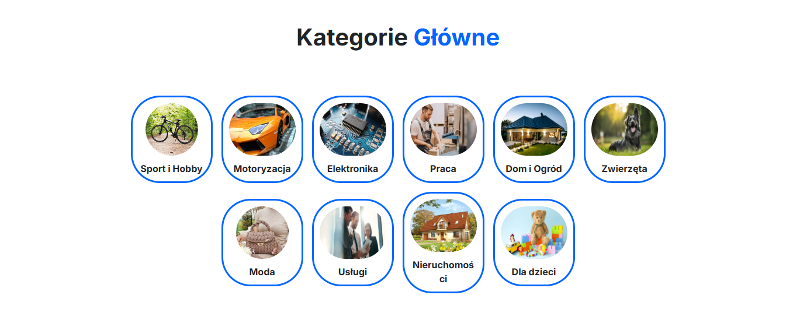
Pod banerem znajdują się wszystkie główne kategorie, które znajdują się w naszym serwsie.
Po kliknieciu na wybraną z kategorii, przenosi na stronę z wypisanymi aukcjami, które należą do danej kategorii.

#### 3. Najnowsze aukcje
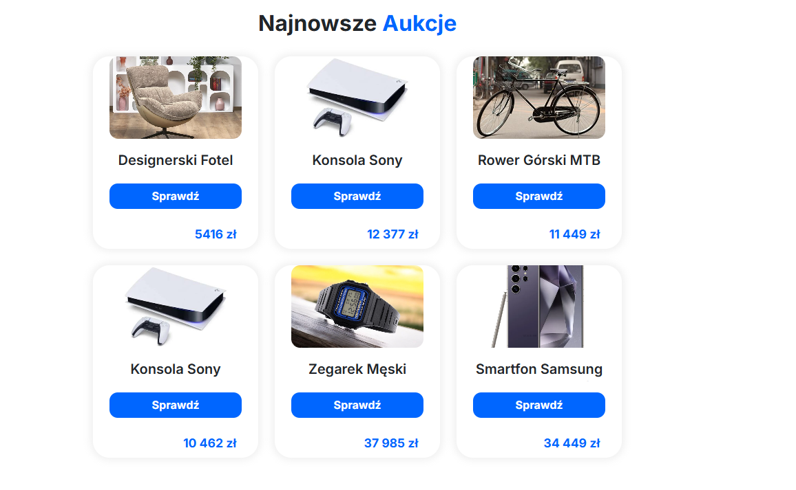

Na stronie głównej w kategorii "Najnowsze aukcje" pokazane jest 6 najnowszych aukcji dodanych w naszym serwisie.
Po kliknięciu przycisku "Sprawdź" przenosi użytkownika do poglądu aukcji.

### Aukcje

#### 1. Wyszukiwanie aukcji

Po wpisaniu na stronej głównej w wyszukiwarce tego co chcemy wyszukać przenosi nas na stronę z zaawansowanym wyszukiwaniem oraz proponowanymi wynikami wyszukiwania, które może zawęzić na kolejnej stronie.

#### 2. Zaawansowane wyszukiwanie aukcji
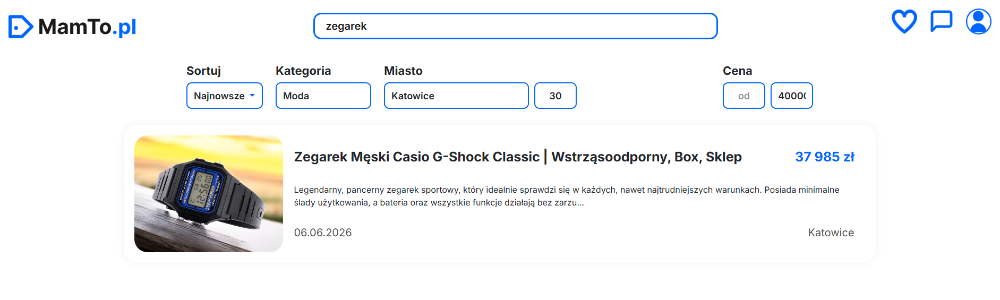
Użytkownik może zawęzić, swoje poszukiwania poprzez zastosowanie zaawansowanego filtrowania.
Można sortować od najnowszych aukcji, po kategorii i podkategoriach oraz względem lokalizacji i jej zasięgu w promieniu x km.

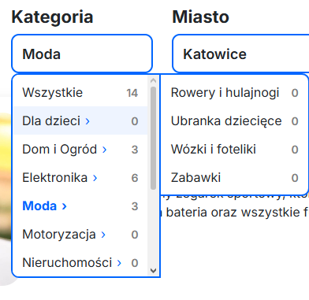

Możemy zawęzić nasze poszukiwania poprzez wyszukanie po podkategoriach. (*Strona wspiera tzw. kategorie drzewiaste*)


#### 3. Podgląd aukcji
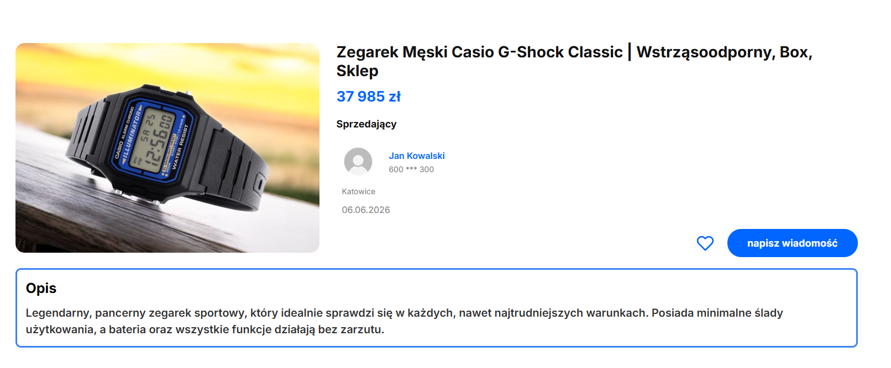

Po kliknięciu na daną aukcję przenosi użytkownika do poglądu danej aukcji.
Informacje o aukcji: tytuł, cena, informacje o sprzedającym, lokalizacja, data utworzenia aukcji oraz szczegółowy opis aukcji.


#### 4. Podgląd profilu sprzedajacego

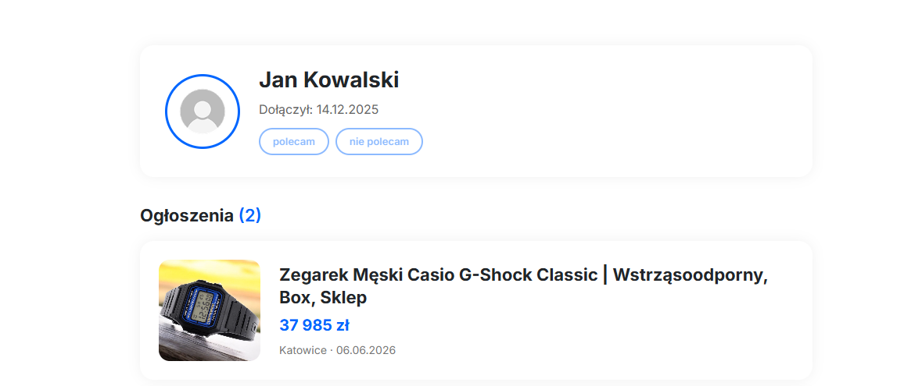
Po klinięciu na nazwę użytkownika sprzedającego, przenosi nas na profil jego profil gdzie możemy sprawdzić jakie jeszcze są przez niego wstawione aukcje, także możemy wystawić mu opinię "Polecam / Nie Polecam" (Opcja możliwa, tylko dla uzytkowników zarejestrowanych dłużej niż 3 miesiące)


#### 5. Możliwość pisania ze sprzedającym
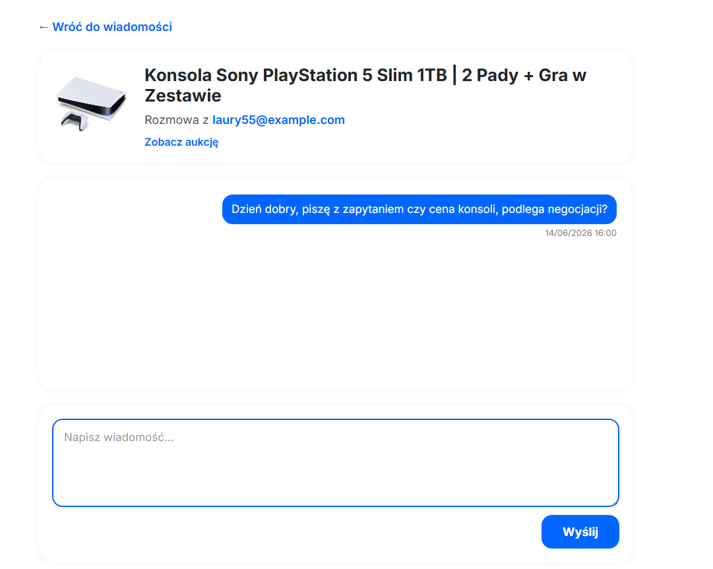

Użytkownik, może po kliknięciu "Napisz wiadomość" znajdującego się na stronie aukcji, rozpocząć konwersację ze sprzedającym, aby móc ustalić cenę zakupu lub inne szczegóły.

### Profil Użytkownika


Po klinkcięciu na ikonkę użytkownika w nawigacji, wyświetla się menu rozwijane.
Poprzez który użytkownik może dostać się do profilu użytkownika, swoich wiadomości, obserwowanych ogłoszeń oraz swoich ogłoszeń.
(Jeśli użytkownik ma uprawnienia Administratora, posiada również opcje Panel Administratora).

#### 1. Aktualizacja danych


Użytkownik może zmodyfikować swoje dane oraz zmienić hasło.

#### 2. Wiadomości
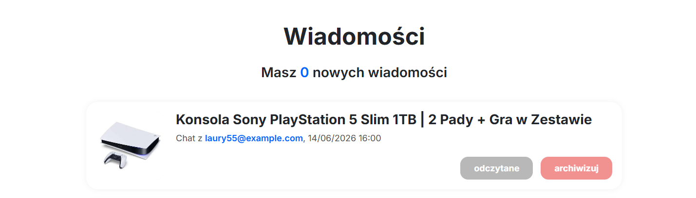

Użytkownik może sprawdzać swoje wiadomości, archiwizować je oraz wchodzić w chat ze sprzedającym z danej aukcji.

#### 3. Aukcje użytkownika (moje aukcje)
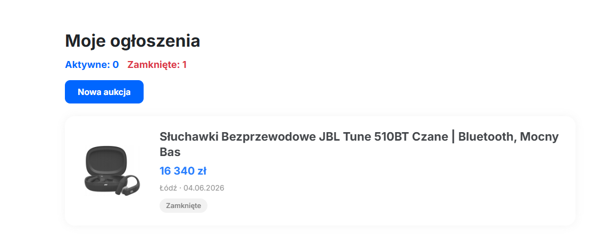

Użytkownik może sprawdzić wszystkie utworzone przez niego aukcje. Również może zamknąć aukcję oraz podglądnąć jej zawartość.

#### 4. Tworzenie nowej aukcji

Użytkownik może dodać nową aukcję poprzez naciśnięcie przycisku "Nowa aukcja".
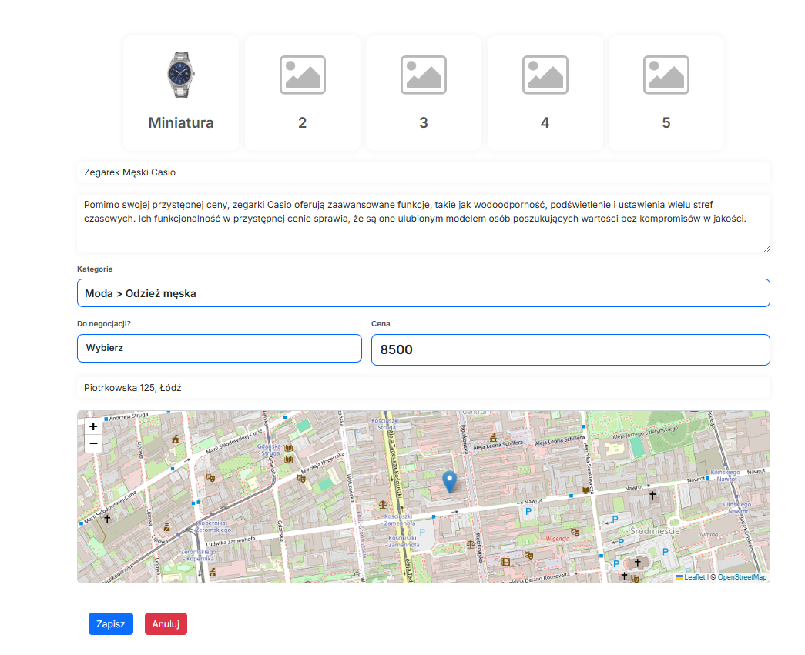
Użytkownik może wgrać od 1 do 5 zdjęć, z czego pierwsze zdjęcie jest zdjęciem głównym.
Obowiązkowe jest dodanie pozostałych informacji takich jak: tytuł, kategoria, czy do negocjacji oraz cena, a także wybór lokalizacji za pomocą mapy.

#### 5. Edycja oraz zamykanie aukcji
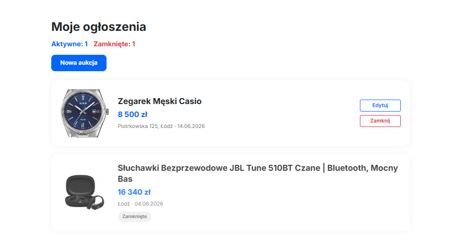


Po kliknięciu na przycisk, zamknij użytkownik zostaje poinformowany, że nie jest możliwe cofnięcie zamknięcia aukcji.

*(Edycja aukcji wygląda tak samo jak jej tworzenie)*

#### 6. Obserwowane aukcje
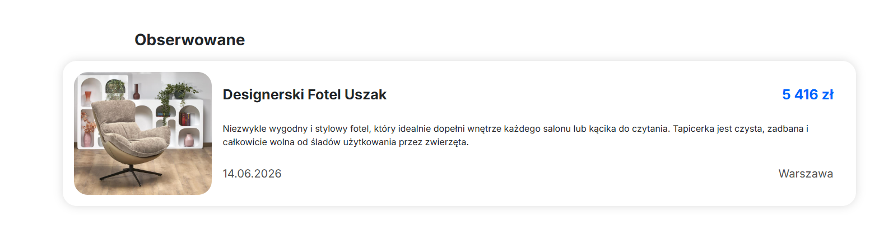

Użytkownik również może zapisywać aukcje, którymi kupnem jest potencjalnie zainteresowany.

### Panel Administratora

#### 1. Aukcje
Do panelu administratora ma dostęp jedynie użytkownik z odpowiednimi uprawnienieniami.
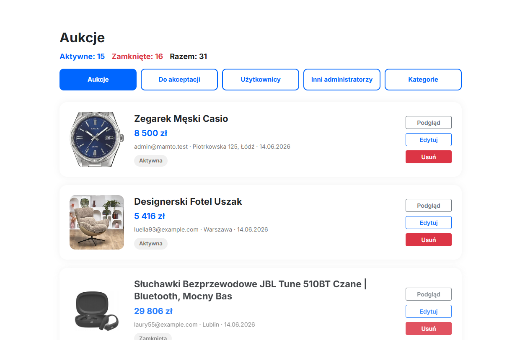

Administrator może podglądnąć informacje o aukcji, edytować oraz usunąć daną aukcję.

#### 2. Akceptowanie Aukcji

Aukcje z kategorii "Praca", muszą być akceptowane przez Administratora.
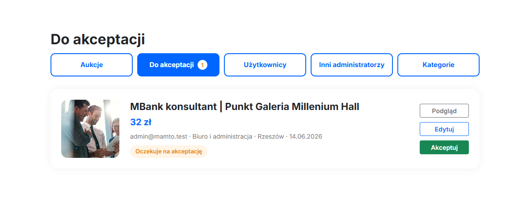
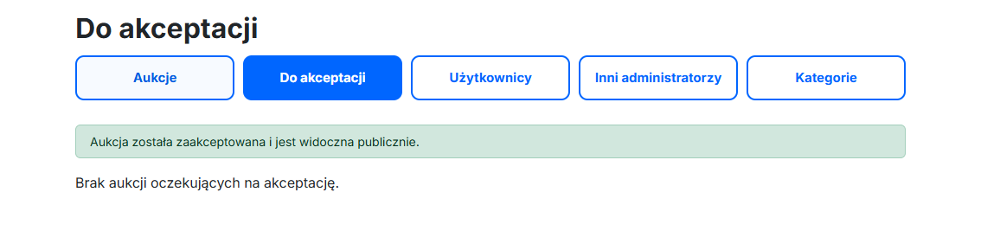

#### 3. Edycja Użytkowników
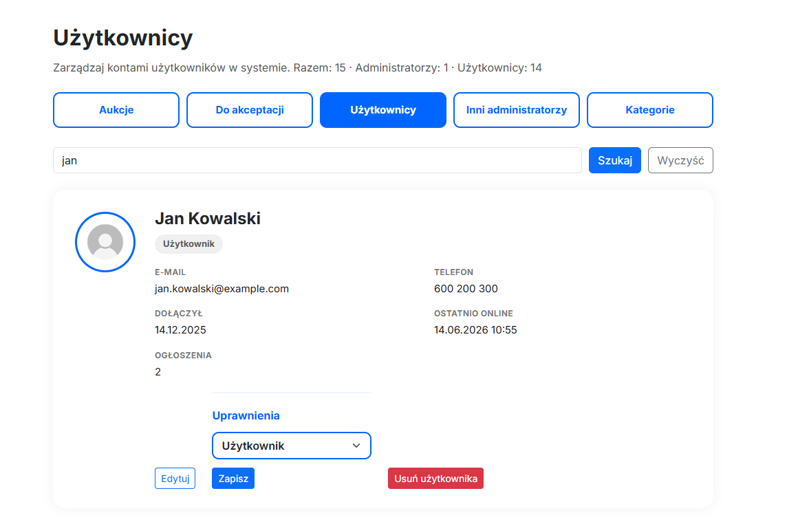

Administrator może edytować dane użytkownika, zmienić jego uprawnienia na Administratora oraz usunąć użytkownika.

#### 3. Edycja / dodawanie kategorii

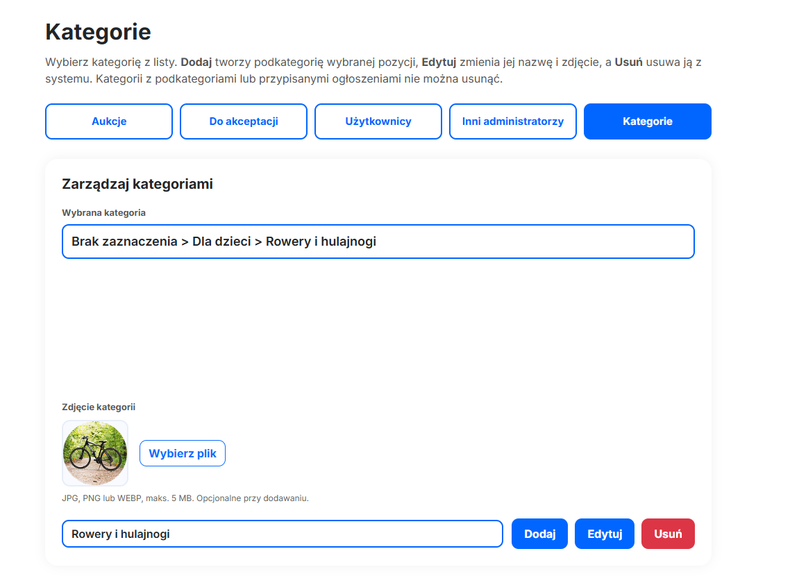

Administrator może edytować kategorie, a także tworzyć nowe.
