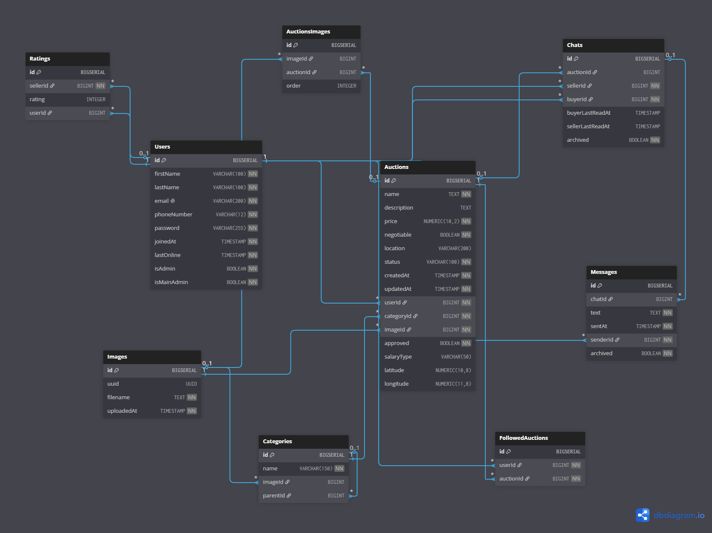
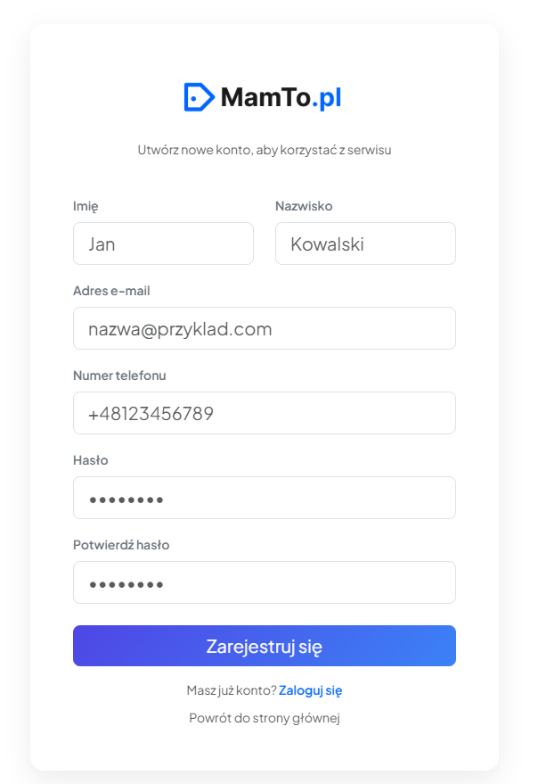
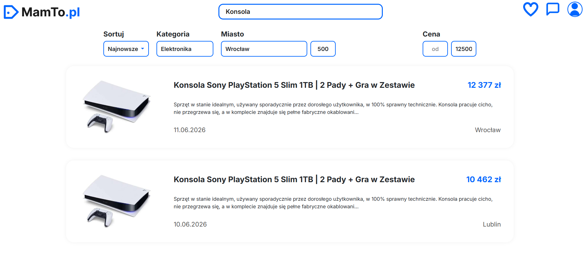
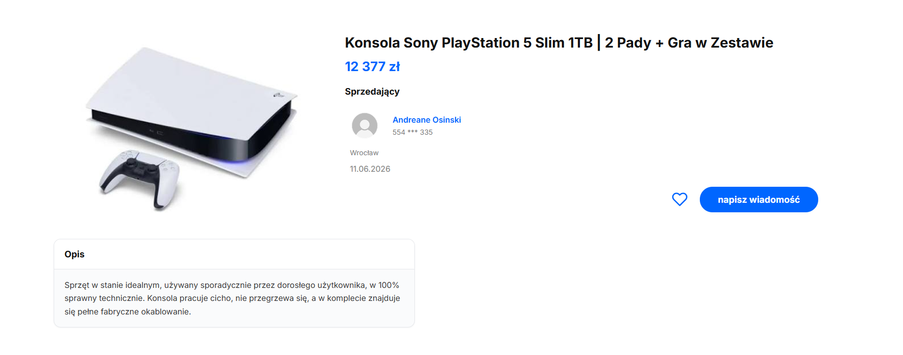
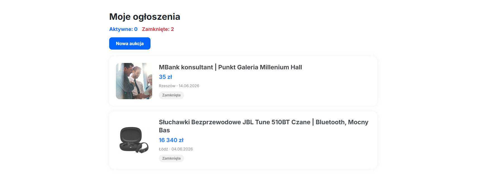
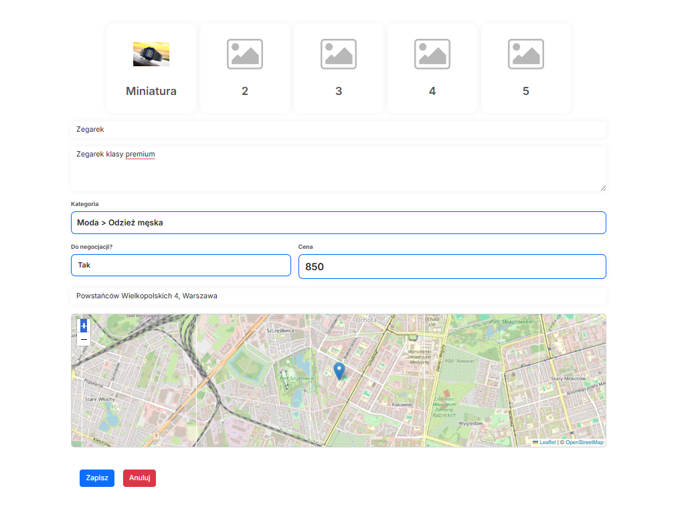
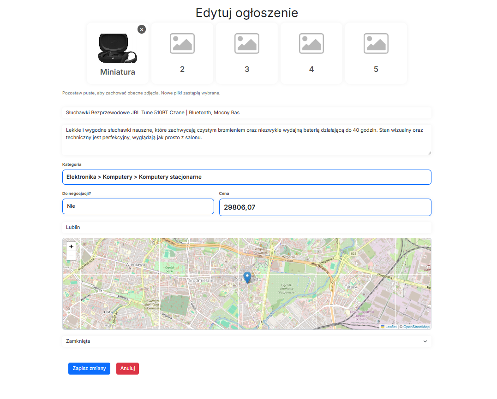

# MamTo.pl

Platforma ogłoszeniowa typu marketplace — użytkownicy mogą bezpłatnie publikować aukcje i ogłoszenia,
przeglądać oferty według kategorii, kontaktować się ze sprzedawcami przez wbudowany czat oraz
zarządzać własnym kontem. Aplikacja posiada panel administratora oraz osobny interfejs RestAPI.

## Spis treści

- [Autorzy](#autorzy)
- [Podział zadań](#podział-zadań)
- [Technologie](#technologie)
- [Przeznaczenie aplikacji](#przeznaczenie-aplikacji)
- [Diagram ERD](#diagram-erd)
- [Uruchomienie](#uruchomienie)
- [Wybrany przebieg działania aplikacji](#wybrany-przebieg-działania-aplikacji)
- [Dalszy rozwój](#dalszy-rozwój)

## Autorzy

- [Mateusz Serafin](https://www.github.com/xserafineq)
- [Przemysław Sulowski](https://www.github.com/sulmorski)

## Podział zadań

| Autor | Zadania |
| :--- | :--- |
| **Mateusz Serafin** | Figma, Layout, Auth (Rejestracja/Logowanie), Aukcje (CRUD), Profil, Panel Admina (Userzy/Aukcje), RestAPI |
| **Przemysław Sulowski** | Czat, Wyszukiwanie/Filtrowanie, Kategorie (drzewiaste + zarządzanie), Oceny, Seedery |

## Technologie

| Warstwa | Technologie |
|---------|-------------|
| **Backend** | PHP 8.3+, Laravel 13, Laravel Sanctum |
| **Baza danych** | PostgreSQL 16 |
| **Frontend** | Blade, Bootstrap 5, JavaScript (Vite), Tailwind CSS 4 |
| **Mapy / lokalizacja** | Leaflet, geokodowanie (Nominatim) |
| **Serwer WWW** | Apache (PHP 8.4) w kontenerze `app` |
| **Build assetów** | Vite 8, npm |
| **Konteneryzacja** | Docker, Docker Compose |

## Przeznaczenie aplikacji

Głównym celem jest stworzenie miejsca w internecie, gdzie zwykli ludzie (albo małe firmy) mogą bez żadnych opłat wystawić na sprzedaż swoje stare meble, ubrania czy elektronikę, a inni mogą te rzeczy łatwo znaleźć i kupić.

### Ogłoszenia i wyszukiwanie

- **Wyszukiwarka:** Wyszukiwanie po frazie, sortowanie i filtry (kategoria, cena, lokalizacja, data).
- **Szczegóły:** Podgląd oferty (opis, galeria) oraz wizytówka sprzedawcy.

### Użytkownik i konto

- **Autoryzacja:** Rejestracja, logowanie i zarządzanie sesją.
- **Profil:** Edycja danych, zmiana hasła.

### Zarządzanie ofertami

- **Moje ogłoszenia:** Dodawanie, edycja i zamykanie ofert (statusy: aktywne, zamknięte, oczekujące).
- **Obserwowane:** Paginowana lista obserwowanych ofert (dodawanie/usuwanie bez przeładowania).
- **Wymogi:** Automatyczna moderacja kategorii „Praca”.

### Komunikacja

- **Czat:** Prywatne wiadomości, lista konwersacji z historią.

### Panel administratora

- **Moderacja:** Zarządzanie ogłoszeniami (w tym akceptacja ofert „Praca”).
- **Administracja:** Zarządzanie użytkownikami, uprawnieniami i strukturą kategorii oraz wszystkimi innymi możliwymi zasobami.

## Diagram ERD

<p align="center">
  
</p>

<p align="center"><em>Rys. 1 — Diagram encji i relacji (ERD)</em></p>

[Szczegółowy opis tabel](db.md)

## Uruchomienie

```bash
docker compose up -d --build
```

### Seeder bazy danych

```bash
docker compose exec app php artisan migrate:fresh --seed
```

## Wybrany przebieg działania aplikacji

**Strona główna → tworzenie konta → wyszukiwanie → moje ogłoszenia → tworzenie aukcji**

### 1. Strona główna

Po wejściu na stronę użytkownik jest automatycznie kierowany na stronę główną. Dostęp do pełnej funkcjonalności serwisu, poza samym przeglądaniem aukcji, wymaga zalogowania.
Użytkownicy nieposiadający jeszcze konta mogą je utworzyć korzystając z formularza rejestracji.

<p align="center">
  
</p>

<p align="center"><em>Strona główna</em></p>

### 2. Rejestracja / logowanie

W celu utworzenia konta użytkownik wypełnia formularz, podając imię, nazwisko, e-mail, numer telefonu oraz hasło. Po kliknięciu przycisku rejestracji następuje automatyczne zalogowanie i przekierowanie na stronę główną.
Powrót do serwisu możliwy jest poprzez standardowe logowanie z użyciem adresu e-mail i hasła.

<table align="center">
  <tr>
    <td align="center" width="50%">
      
      <br>
      <em>Rejestracja</em>
    </td>
    <td align="center" width="50%">
      
      <br>
      <em>Logowanie</em>
    </td>
  </tr>
</table>

<p align="center"><em>Rejestracja  i logowanie</em></p>

### 3. Wyszukiwanie aukcji

Użytkownik może wyszukiwać aukcje po nazwie oraz stosować zaawansowane filtry, które pozwalają zawęzić poszukiwania poprzez uwzględnienie kategorii, miejscowości oraz ceny.

<p align="center">
  
</p>

<p align="center"><em>Wyszukiwanie i filtrowanie ofert</em></p>

### 4. Podgląd aukcji

Użytkownik może sprawdzić zawartość aukcji, którą jest zainteresowany. Można uzyskać m.in. tytuł, cenę, dane sprzedającego, lokalizację oraz datę wystawienia aukcji, a także opis.
Zainteresowany kupnem danej rzeczy może skontaktować się ze sprzedającym poprzez napisanie do niego prywatnej wiadomości. Można również aukcję zaobserwować, by mieć ją cały czas na uwadze.

<p align="center">
  
</p>

<p align="center"><em>Szczegóły aukcji</em></p>

### 5. Profil użytkownika

Po kliknięciu ikony profilu w menu nawigacyjnym wyświetli się lista opcji.
W ramach tej ścieżki użytkownik będzie korzystał przede wszystkim z zakładki „Moje ogłoszenia”.

<p align="center">
  
</p>

<p align="center"><em>Menu profilu użytkownika</em></p>

### 6. Moje ogłoszenia

Sekcja „Moje ogłoszenia” pozwala zarządzać wszystkimi wystawionymi ofertami.
Użytkownik może w niej edytować szczegóły ogłoszeń oraz zmieniać ich status na zamknięty. Aby utworzyć nową ofertę, wystarczy skorzystać z przycisku „Nowa aukcja”.

<p align="center">
  
</p>

<p align="center"><em>Moje ogłoszenia</em></p>

### 7. Dodawanie nowej aukcji

Aby dodać nową aukcję, użytkownik musi wypełnić formularz, podając: co najmniej jedno zdjęcie (miniatura),
tytuł, opis, cenę, lokalizację oraz zaznaczyć, czy cena podlega negocjacji.

<p align="center">
  
</p>

<p align="center"><em>Dodawanie nowej aukcji</em></p>

### 7. Edytowanie aukcji

Edytowanie aukcji odbywa się w ten sam sposób jak jej dodawanie. Użytkownik może zmieniać wybraną przez siebie zawartość w formularza. (Dane, zdjęcia, lokalizacje)
<p align="center">
  
</p>

<p align="center"><em>Dodawanie nowej aukcji</em></p>


## Dalszy rozwój

- powiadomienia e-mail przy wiadomościach i akceptacji ogłoszeń
- wiadomości w czasie rzeczywistym
